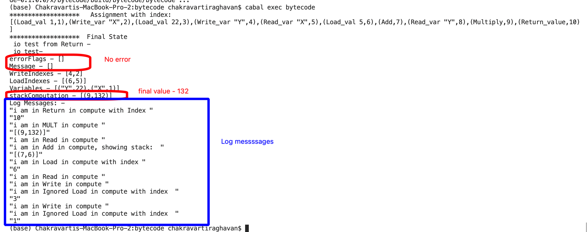
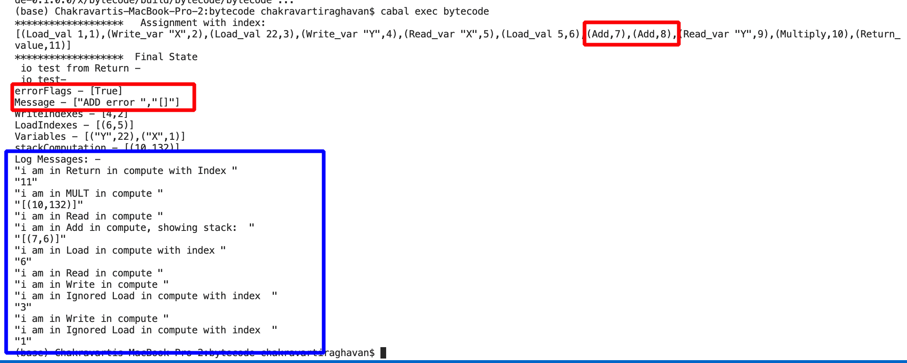

# Project StudentGrading
Automate Student Grading 

## Summary

This project takes a Pseudo code for Students assignment in a file which has some basic Add/Multiply set of expressions and helps the Professor pre-screen by running students assigment to see the completeness of Assignment.

It will give error with messages if somethign is wrong. 

If its correct there is no error messages and flags and final Stack will have the final computation.

### Sample Initial file:

This below is valid assignment.

| Bytecode File |
| ------------- |
| LOAD_VAL 1    |
| WRITE_VAR X   |
| LOAD_VAL 2    |
| WRITE_VAR  Y  |
| READ_VAR X    |
| LOAD_VAL 1    |
| ADD           |
| READ_VAR Y    |
| MULTIPLY      |
| RETURN_VALUE  |

### Ground Rules 

| Rules                                                        |
| ------------------------------------------------------------ |
| Return_value will be last. Anything other place has to error |
| Write - every write needs to have preceeding Load so that the variable is stored. Otherwise there will be error. |
| Load without Write right after means its ready to be used in Add/Mutiply |
| Add/Multiply will operate on 2 stored valus on stack. If its missing that's an error. Once its computed the prior 2 values are erased as its consumed and current value will be stored for future consumption. |
|                                                              |

### Implementation 

#### Monads used 

MonadIO m, MonadReader [ByteCodeIndexed] m, MonadState StateStack m

#### Implementation 

we start by reading the file and unpacking each instruction into our custom data type ByteCode.

Then due to the nature of looking back to see if Write has a preceding Load etc. we not move the ByteCode to index each instruction into ByteCodeIndexed list. This way when there is a Write instruction we make immediately preceding there is a Load instruction. 

First we update the state writeIndex with all the writes we have. 

Then we process all the Load instructions and put indexs on each Load. 

Next step we create the Variables list for the writes but also do error handling to make sure Write precedes with Load. At this point we have all our varibles.

Now we execute the `compute` function that reads each instruction and starts building and consuming the `StackComputation`

A Load (only the non Load/write combo are considered) or Read will result is Pushing the value into the stack computation to be consumed later.

An Add or Multiply will consume 2 from the stack and will be popped out of the stack but now its current calculation is pushed onto the stack for furhter computation. 

### Results

